# R3 pilots: results

Protocol: `docs/lab/r3_pilots_protocol.md`. Exploratory; nothing here is a claim.

## p1_bn4 (t1) · 2026-10-01 23:40

References on the same validation seeds (mean_val_outflow): no control 992.0, best constant 1054.0, tuned classical 1343.3333333333333.

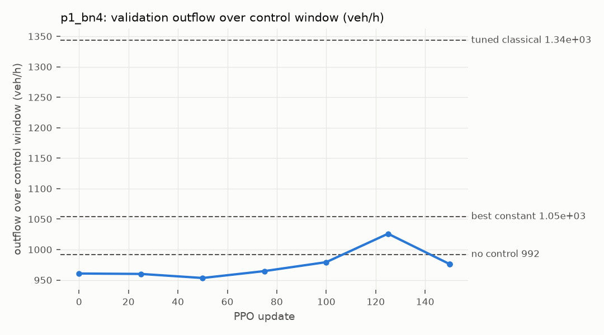

| seed | updates | initial | final | best val (update) | C1 val | C1 reward | C3 ≥ NC+5% | C2 > const | beats tuned classical | health FAIL | screening |
|---|---|---|---|---|---|---|---|---|---|---|---|
| 0 | 150 | 960.6666666666666 | 976.0 | 1026.0 (125) | True | True | False | False | False | 0 | **FAIL** |

## p2_ring_hyb (t3) · 2026-10-01 23:57

References on the same validation seeds (mean_val_speed): no control 3.579283333333333, best constant 3.847716666666667, tuned classical 4.1594500000000005.

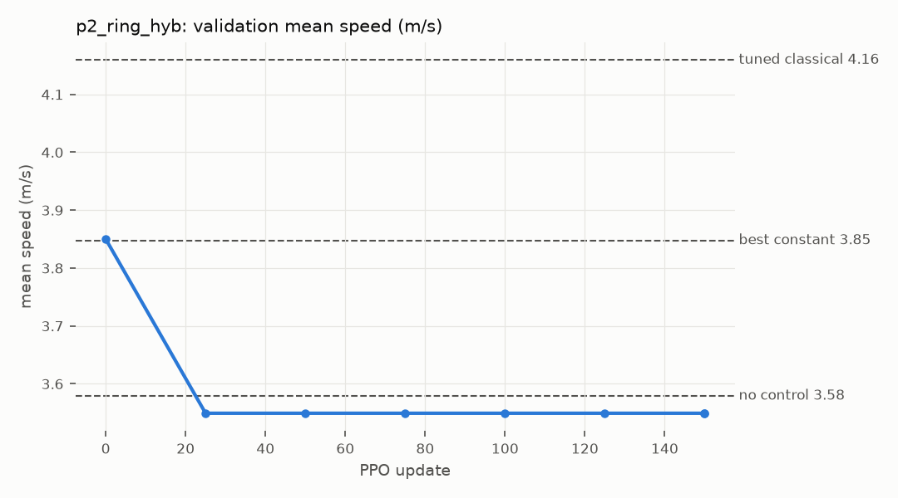

| seed | updates | initial | final | best val (update) | C1 val | C1 reward | C3 ≥ NC+5% | C2 > const | beats tuned classical | health FAIL | screening |
|---|---|---|---|---|---|---|---|---|---|---|---|
| 0 | 150 | 3.850058112795961 | 3.549239861016535 | 3.549239861016535 (25) | False | True | False | False | False | 0 | **FAIL** |

## p3_ring_dir (t3) · 2026-10-01 23:57

References on the same validation seeds (mean_val_speed): no control 3.579283333333333, best constant 3.847716666666667, tuned classical 4.1594500000000005.

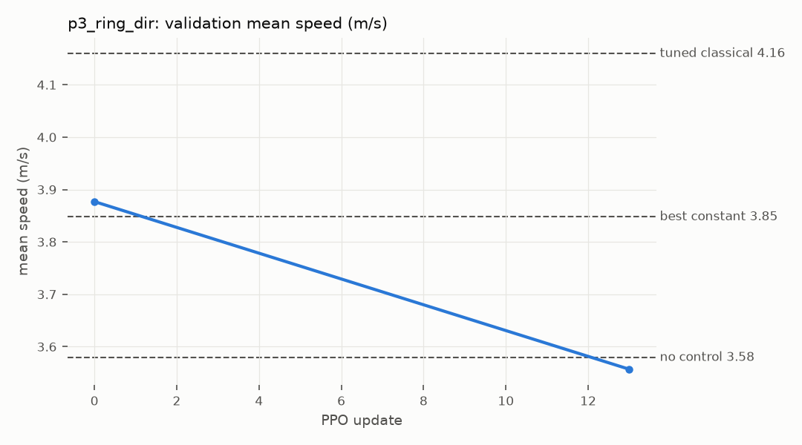

| seed | updates | initial | final | best val (update) | C1 val | C1 reward | C3 ≥ NC+5% | C2 > const | beats tuned classical | health FAIL | screening |
|---|---|---|---|---|---|---|---|---|---|---|---|
| 0 | 13 | 3.8769198255967487 | 3.556864546016508 | None (None) | False | False | False | False | False | 55 | **FAIL** |

## p1b_bn4 (t1) · 2026-10-02 00:12

References on the same validation seeds (mean_val_outflow): no control 992.0, best constant 1054.0, tuned classical 1343.3333333333333.

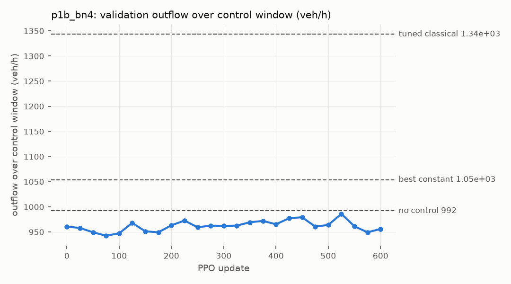

| seed | updates | initial | final | best val (update) | C1 val | C1 reward | C3 ≥ NC+5% | C2 > const | beats tuned classical | health FAIL | screening |
|---|---|---|---|---|---|---|---|---|---|---|---|
| 0 | 600 | 960.6666666666666 | 956.0 | 986.0 (525) | False | True | False | False | False | 0 | **FAIL** |

## p1c_bn4 (t1) · 2026-10-02 00:12

References on the same validation seeds (mean_val_outflow): no control 992.0, best constant 1054.0, tuned classical 1343.3333333333333.

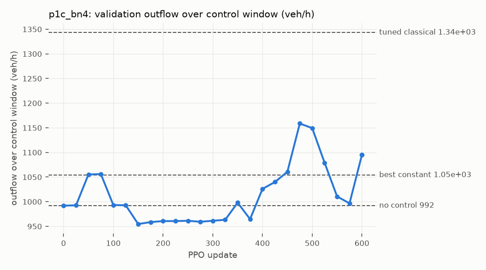

| seed | updates | initial | final | best val (update) | C1 val | C1 reward | C3 ≥ NC+5% | C2 > const | beats tuned classical | health FAIL | screening |
|---|---|---|---|---|---|---|---|---|---|---|---|
| 0 | 600 | 992.0 | 1095.3333333333333 | 1158.6666666666667 (475) | True | True | True | True | False | 0 | **PASS** |

## p1d_bn4 (t1) · 2026-10-02 00:42

References on the same validation seeds (mean_val_outflow): no control 992.0, best constant 1054.0, tuned classical 1343.3333333333333.

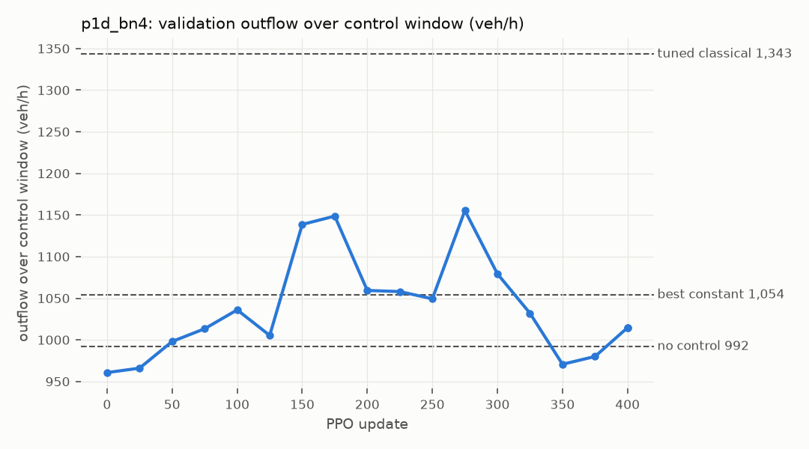

| seed | updates | initial | final | best val (update) | C1 val | C1 reward | C3 ≥ NC+5% | C2 > const | beats tuned classical | health FAIL | screening |
|---|---|---|---|---|---|---|---|---|---|---|---|
| 0 | 400 | 960.6666666666666 | 1014.6666666666666 | 1155.3333333333333 (275) | True | True | True | True | False | 0 | **PASS** |

## p1e_bn4 (t1) · 2026-10-02 00:42

References on the same validation seeds (mean_val_outflow): no control 992.0, best constant 1054.0, tuned classical 1343.3333333333333.

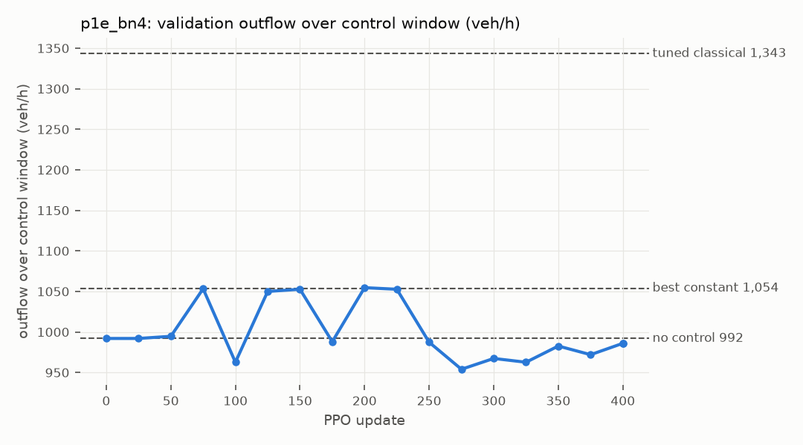

| seed | updates | initial | final | best val (update) | C1 val | C1 reward | C3 ≥ NC+5% | C2 > const | beats tuned classical | health FAIL | screening |
|---|---|---|---|---|---|---|---|---|---|---|---|
| 0 | 400 | 992.0 | 986.0 | 1054.6666666666667 (200) | False | True | True | True | False | 0 | **FAIL** |

## p1f_bn4 (t1) · 2026-10-02 00:55

References on the same validation seeds (mean_val_outflow): no control 992.0, best constant 1054.0, tuned classical 1343.3333333333333.

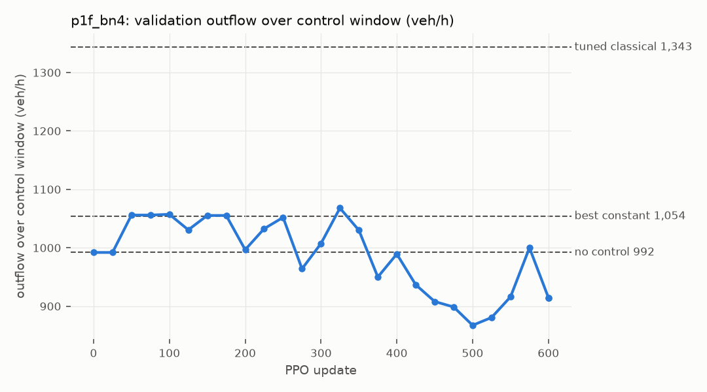

| seed | updates | initial | final | best val (update) | C1 val | C1 reward | C3 ≥ NC+5% | C2 > const | beats tuned classical | health FAIL | screening |
|---|---|---|---|---|---|---|---|---|---|---|---|
| 0 | 600 | 992.0 | 914.6666666666666 | 1068.0 (325) | False | True | True | True | False | 0 | **FAIL** |

## f1_bn4 (t1) · 2026-10-02 01:18

References on the same validation seeds (mean_val_outflow): no control 992.0, best constant 1054.0, tuned classical 1343.3333333333333.

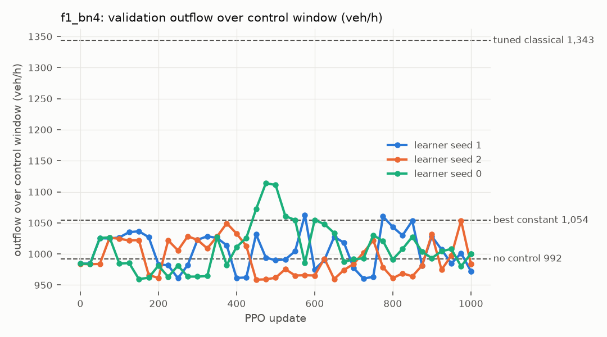

| seed | updates | initial | final | best val (update) | C1 val | C1 reward | C3 ≥ NC+5% | C2 > const | beats tuned classical | health FAIL | screening |
|---|---|---|---|---|---|---|---|---|---|---|---|
| 1 | 1000 | 984.4444444444445 | 972.4444444444445 | 1062.6666666666667 (575) | False | True | True | True | False | 0 | **FAIL** |
| 2 | 1000 | 984.0 | 984.0 | 1053.7777777777778 (975) | False | False | True | False | False | 0 | **FAIL** |
| 0 | 1000 | 984.4444444444445 | 1000.4444444444445 | 1113.7777777777778 (475) | True | False | True | True | False | 0 | **FAIL** |

## F1 (F class) and R5 on test seeds: conclusion for Track 1 (2026-10-02)

**F1**, the P1c configuration with 3 learner seeds × 1,000 updates, validated on 9 episodes:

| Seed | Final | Best validation | Screening |
|---|---|---|---|
| 0 | 1,000 | 1,114 | FAIL |
| 1 | 972 | 1,063 | FAIL |
| 2 | 984 | 1,054 | FAIL |

NC on this set is ≈ 984.

**R5 on fresh test seeds** (7,110,500–7,110,529; door-to-door time incl. origin queue; final policies, pooled; vs NC):

| q (veh/h) | DRL − NC | Reading |
|---|---|---|
| 1,200 | **+8.6 %** | worse; CI excludes 0 |
| 1,600 | +0.8 % | n.s. |
| 2,000 | 0.0 % | n.s. |
| 2,400 | −0.2 % | n.s. |

The best-validation checkpoints behave the same: ≈ NC when congested and +5 % worse at q = 1,200.

**Pre-registered reading: FAIL.**
- With 10 % AVs on BN4, the learned AV-cap policies do not beat NC or the best constant cap on test seeds.
- No tuned classical controller on this actuator beats NC either.
- The infrastructure meter beats everything by 45 %.

**P1c's single-seed screening pass was a false positive.** Two things produced it: 6-episode validation noise, and selection over 5 variants. The multi-seed F class and the test-seed R5 caught it, as designed.

## p2b_ring_hyb (t3) · 2026-10-02 03:10

References on the same validation seeds (mean_val_speed): no control 3.579283333333333, best constant 3.847716666666667, tuned classical 4.1594500000000005.

| seed | updates | initial | final | best val (update) | C1 val | C1 reward | C3 ≥ NC+5% | C2 > const | beats tuned classical | health FAIL | screening |
|---|---|---|---|---|---|---|---|---|---|---|---|
| 0 | 600 | 3.850058112795961 | 3.5488276141006914 | 3.549251481661047 (400) | False | True | False | False | False | 0 | **FAIL** |

## p3b_ring_dir (t3) · 2026-10-02 03:20

References on the same validation seeds (mean_val_speed): no control 3.579283333333333, best constant 3.847716666666667, tuned classical 4.1594500000000005.

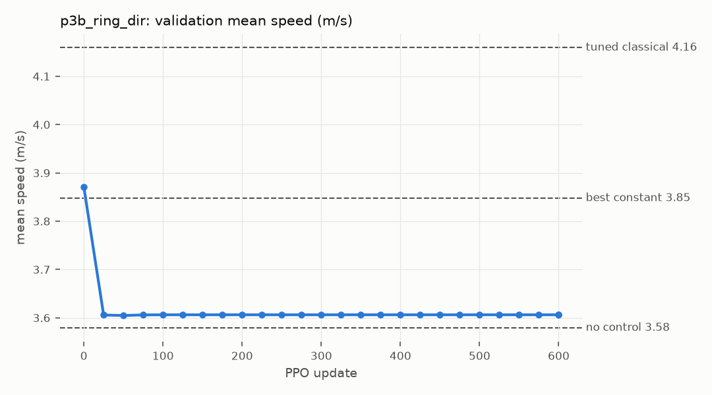

| seed | updates | initial | final | best val (update) | C1 val | C1 reward | C3 ≥ NC+5% | C2 > const | beats tuned classical | health FAIL | screening |
|---|---|---|---|---|---|---|---|---|---|---|---|
| 0 | 600 | 3.8707829608026816 | 3.6061642264100287 | 3.6061642264100287 (100) | False | True | False | False | False | 0 | **FAIL** |

## f2_bn4 (t1) · 2026-10-02 05:43

References on the same validation seeds (mean_val_outflow): no control 992.0, best constant 1054.0, tuned classical 1343.3333333333333.

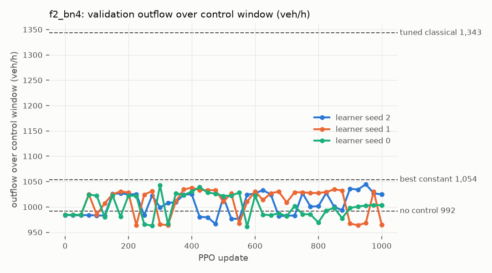

| seed | updates | initial | final | best val (update) | C1 val | C1 reward | C3 ≥ NC+5% | C2 > const | beats tuned classical | health FAIL | screening |
|---|---|---|---|---|---|---|---|---|---|---|---|
| 2 | 1000 | 984.0 | 1024.888888888889 | 1044.888888888889 (950) | True | False | True | False | False | 0 | **FAIL** |
| 1 | 1000 | 984.4444444444445 | 964.8888888888889 | 1037.7777777777778 (400) | False | True | False | False | False | 0 | **FAIL** |
| 0 | 1000 | 984.4444444444445 | 1003.5555555555555 | 1042.6666666666667 (300) | True | True | True | False | False | 0 | **FAIL** |

## p2c_ring_hyb (t3) · 2026-10-02 07:59

References on the same validation seeds (mean_val_speed): no control 3.579283333333333, best constant 3.847716666666667, tuned classical 4.1594500000000005.

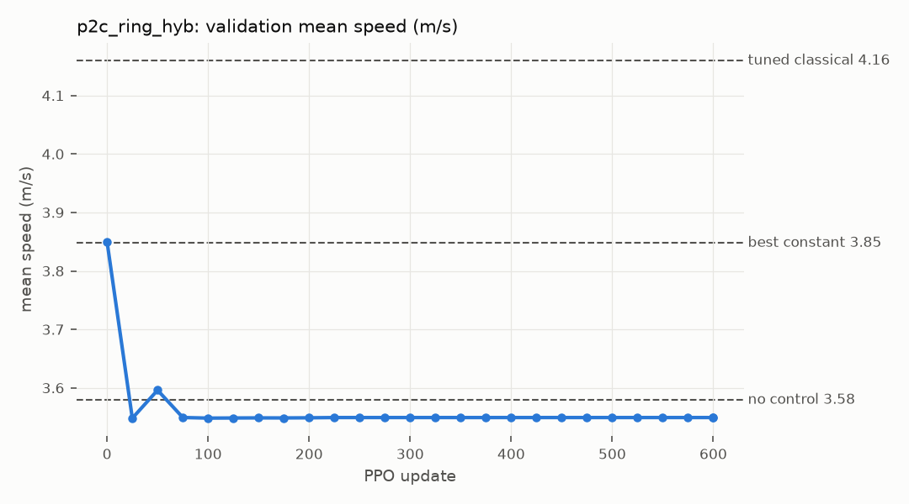

| seed | updates | initial | final | best val (update) | C1 val | C1 reward | C3 ≥ NC+5% | C2 > const | beats tuned classical | health FAIL | screening |
|---|---|---|---|---|---|---|---|---|---|---|---|
| 0 | 600 | 3.8500986831571633 | 3.549239861016535 | 3.5960468093157565 (50) | False | True | False | False | False | 0 | **FAIL** |

## p2d_ring_hyb (t3) · 2026-10-02 07:59

References on the same validation seeds (mean_val_speed): no control 3.579283333333333, best constant 3.847716666666667, tuned classical 4.1594500000000005.

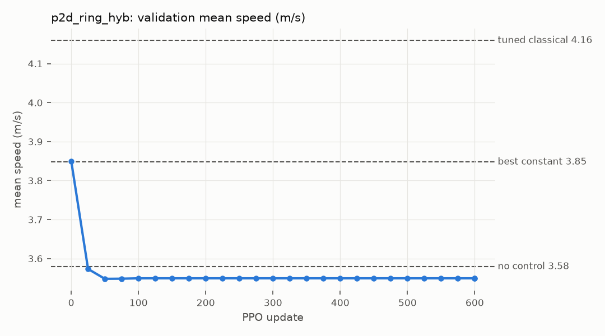

| seed | updates | initial | final | best val (update) | C1 val | C1 reward | C3 ≥ NC+5% | C2 > const | beats tuned classical | health FAIL | screening |
|---|---|---|---|---|---|---|---|---|---|---|---|
| 0 | 600 | 3.8500845384554023 | 3.549239861016535 | 3.573212342440088 (25) | False | True | False | False | False | 0 | **FAIL** |

## p6_bn4av25 (t1) · 2026-10-02 11:24

References on the same validation seeds (mean_val_outflow): no control 977.7777777777778, best constant 981.3333333333334, tuned classical 1368.4444444444443.

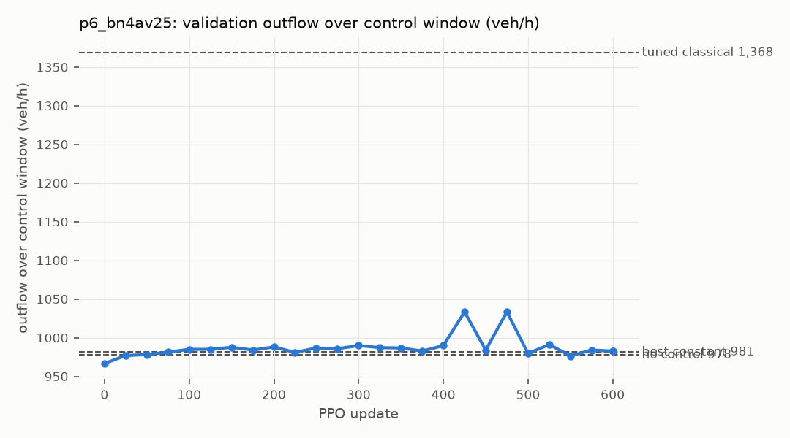

| seed | updates | initial | final | best val (update) | C1 val | C1 reward | C3 ≥ NC+5% | C2 > const | beats tuned classical | health FAIL | screening |
|---|---|---|---|---|---|---|---|---|---|---|---|
| 0 | 600 | 966.6666666666666 | 982.6666666666666 | 1033.3333333333333 (425) | True | True | True | True | False | 0 | **PASS** |

## bf_bn4av25 (t1) · 2026-10-02 13:41

References on the same validation seeds (mean_val_outflow): no control 977.7777777777778, best constant 981.3333333333334, tuned classical 1368.4444444444443.

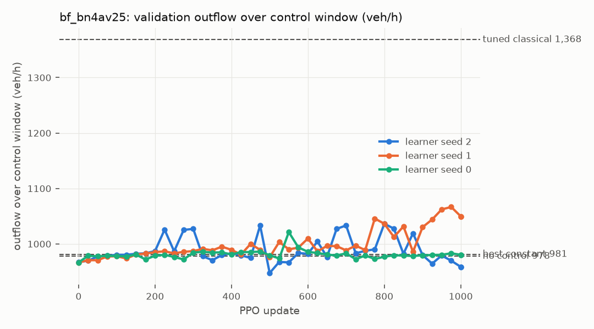

| seed | updates | initial | final | best val (update) | C1 val | C1 reward | C3 ≥ NC+5% | C2 > const | beats tuned classical | health FAIL | screening |
|---|---|---|---|---|---|---|---|---|---|---|---|
| 2 | 1000 | 967.1111111111111 | 958.6666666666666 | 1036.4444444444443 (800) | False | True | True | True | False | 0 | **FAIL** |
| 1 | 1000 | 966.6666666666666 | 1049.7777777777778 | 1066.6666666666667 (975) | True | True | True | True | False | 0 | **PASS** |
| 0 | 1000 | 966.6666666666666 | 980.4444444444445 | 1021.3333333333334 (550) | True | True | False | True | False | 0 | **FAIL** |
